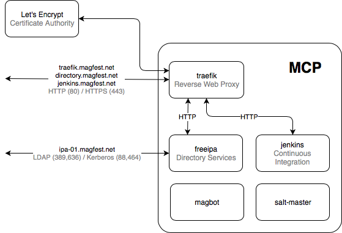

# Master Control Program Server

MCP is the central piece of MAGFest's IT infrastructure. MCP provisions and
manages the configuration of all of our other servers.



## Bootstrapping the MCP server

Creating an MCP server should only need to be done rarely; ideally just once.

### Step 1 – Create Server

Create a new droplet on [https://digitalocean.com](https://digitalocean.com)
  * Ubuntu 16.04.4 x64
  * Add a block storage volume (this will need to be mounted on `/srv/data`)
  * Select "Private Networking" and "Monitoring"
  * Add the following SSH Keys: "Saltmaster", "Rob Ruana", and "DomMCP"

### Step 2 – Update DNS

By default the salt-minions will attempt to connect to `saltmaster.magfest.net`,
so the DNS entry for `saltmaster.magfest.net` should be updated to point to the
new droplet's **Private IP**.

### Step 3 – Mount Block Storage

Follow Digital Ocean's instructions for configuring and mounting your block storage volume on `/srv/data`.
  * If you're adding a _new_ volume, you'll need to format the volume:
    <div class="bs-callout bs-callout-danger bg-white">
      <h4>This step will <b>DESTROY</b> any existing data on the volume!</h4>
      <div class="highlighter-rouge">
        <div class="highlight">
<pre><code>
mkfs.ext4 -F /dev/disk/by-id/scsi-0DO_Volume_volume-nyc1-01
</code></pre>
        </div>
      </div>
    </div>
  * After formatting, or if you're mounting an already formatted volume:
```
mkdir -p /srv/data; \
mount -o discard,defaults /dev/disk/by-id/scsi-0DO_Volume_volume-nyc1-01 /srv/data; \
echo /dev/disk/by-id/scsi-0DO_Volume_volume-nyc1-01 /srv/data ext4 defaults,nofail,discard 0 0 | tee -a /etc/fstab
```

### Step 4 – Run Bootstrap Script

As root/sudo run the following command and follow the instructions it prints when finished:
```
curl -L https://github.com/magfest/infrastructure/raw/master/bootstrap-mcp.sh | sh
```
