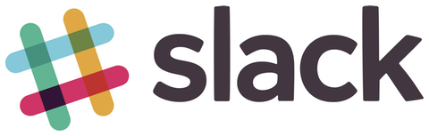
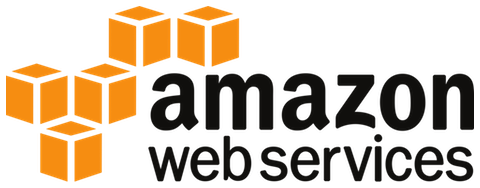
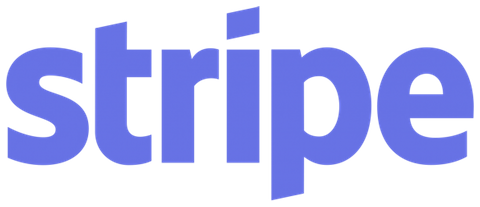

# Services We Use

See also [Technologies We Use](technologies.html)

<h1></h1>

[Slack](https://magfest.slack.com) is the easiest way to communicate ideas
and ask questions within the MAGFest organization. The following channels
are of particular note for system administrators and software developers:

* \#devops - discussion about all things software related
* \#techops - discussion about all things engineering and tech related
* \#devbots - automated posts about changes in GitHub, Jira, and any of our
other software related services
* \#devbots_errors (private) - errors in any of our production Reggie
deployments are posted here
* \#devops-sensitive (private) - discussion of Reggie bugs that require
specific PII attendee data to replicate
* \#deploy_labs, \#deploy_magstock, \#deploy_super, \#deploy_west - magbot runs
all of our Reggie deployments from these slack channels

As much as possible, all software development discussion should be done in
the open, with as much opportunity for feedback as possible. The only reason
\#devbots_errors and \#devops-sensitive are private is that those channels may
include PII data about specific attendees that have triggered a bug.

[MAGBot](https://github.com/magfest/magbot), MAGFest's custom ChatOps bot,
also plays a central role for MAGFest software developers and sysadmins.
MAGBot runs deployments, posts badge sales, and generally keeps the mood
light on Slack.

MAGBot is based on [Errbot](http://errbot.io), and written in Python.
Developing for MAGBot is fun and easy, and provides fertile ground for
supercharging our productivity.

<h1></h1>

Aside from Slack, MAGFest's primary form of communication within the
organization is email, calendars, and docs provided by
[Google G Suite](https://gsuite.google.com). We also use G Suite to
organize both internal and external mailing lists.

<h1></h1>

MAGFest keeps all of its shared passwords in
[Last Pass](https://www.lastpass.com). You'll need shared passwords to
access many of the other services on this list. For some of the services
you'll be able to create your own user account, but for others you'll
need to use a shared account.

Talk to the \@officecrew folks in the \#office channel on Slack to get
access to passwords stored in Last Pass.

<h1></h1>

Our [main website](https://magfest.org) and the
[Super website](https://super.magfest.org) both run on Square Space. Our
website and various social media accounts are the primary ways we disseminate
information to and interact with the external community. For questions about
the website, head to the \#webdev channel in
[Slack](https://magfest.slack.com).

<h1></h1>

All of the software built by MAGFest resides in the MAGFest GitHub accounts:

* [github.com/magfest](github.com/magfest) - The main MAGFest account,
contains all our active software projects
* [github.com/magfest-archive](http://github.com/magfest-archive) - The
MAGFest software archive, decommissioned projects moved here to declutter
the main MAGFest account

<h1></h1>

MAGFest's infrastructure runs on Digital Ocean's cloud hosted servers. In
addition to all of our staging and production
[Reggie](https://github.com/magfest/reggie-formula) servers, we also run
our own [FreeIPA directory service](https://directory.magfest.net),
[Jira server](https://jira.magfest.net),
[Confluence server](https://docs.magfest.net),
log aggregation server, backup server, and other various servers.

All of our servers on Digital Ocean are located in the NYC1 region, and all
inter-server communication runs across a private network. SSH authentication
is provided by our [FreeIPA directory](https://directory.magfest.net).

<h1></h1>

MAGFest's DNS is managed by [DNS Made Easy](https://dnsmadeeasy.com).

<h1></h1>

Our [Jira issue tracking server](https://jira.magfest.net) is a core piece of
MAGFest's infrastructure. The server is hosted on one of our Digital Ocean
droplets (hostname jira.magfest.net). Our daily office tasks, as well as all
of our other projects – including our software development projects – are
tracked and managed in Jira.

<h1></h1>

Our [Confluence server](https://docs.magfest.net) is most frequently used
to post our daily standups, and sprint summaries. The server is hosted on
one of our Digital Ocean droplets (hostname docs.magfest.net). Most of our
docs live in our Google Drive, but some projects also use confluence for
their docs.

<h1></h1>

Most of our domain names were purchased through
[Name Cheap](https://www.namecheap.com/). Some of our SSL certificates
were also purchased through Name Cheap, though we're transitioning to
Let's Encrypt certificates.

<h1></h1>

[Reggie](https://github.com/magfest/reggie-formula) uses
[Amazon's Simple Email Service](https://aws.amazon.com/ses/)
to send all of its emails.

<h1></h1>

[Reggie](https://github.com/magfest/reggie-formula) uses
Twillio to send all of its SMS notifications.

<h1></h1>

[Reggie](https://github.com/magfest/reggie-formula) uses
Stripe to process all of its online payments.
